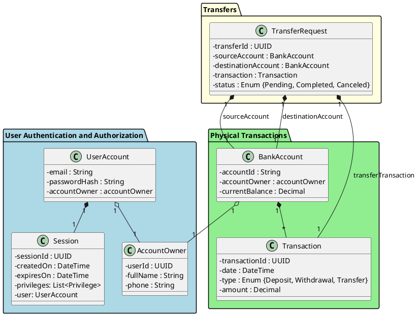

# Zadanie 1

## Model bezpiecznej aplikacji bankowej

## Identyfikacja kontekstów oraz ich elementów
### User Authentication and Authorization
Kontekst jest opdowiedzialny za akcje związane z kontrolą dostępu użytkownika do aplikacji. Przeprowadzane jest uwierzytelnienie oraz autoryzacja na podstawie danych załączonych przez użytkownika.

Zawiera w sobie elementy takie jak:
- Agregaty:
    - AccountOwner - przedstawienie osoby posiadającej konto bankowe
    - UserAccount - przedstawia wirutalną instancję konta mającego możliwość korzystania z kont bankowych
- Encje:
    - Session - sesja aplikacji webowej przedstawiająca użytkownika korzystającego z aplikacji
 
### Physical Transactions
Kontekst zawiera w sobie elementy dotyczące akcji wykonywanych na koncie, takich jak: wpłata/wypłata pieniędzy w bankomacie oraz przelew pieniądzy

Zawiera w sobie elementy takie jak:
- Agregaty:
    - BankAccount - obrazuje instancję konta bankowego posiadającego swoje konkretne dane oraz transakcje
- Encje:
    - Transaction - obrazuję instancję transakcji, może to być wpłata/wypłata pieniędzy oraz transakcję z konta na konto

### Transfers

Kontekst zawiera w sobie elementy dotyczące prób wykonywanych transferów pieniędzy.
Zawiera w sobie elementy takie jak:
- Encje:
    - TransferRequest - obrazuje chęć wykonania transferu pieniędzy, która może być zaakceptowana lub odrzucona 
## Zdefiniowanie założeń
### UserAccount

| Nazwa        | Typ          | Walidacja                                                                                                                                                             |
|--------------|--------------|-----------------------------------------------------------------------------------------------------------------------------------------------------------------------|
| email        | String       | Wartość wejściowa to ciąg znaków zawierający od 1 do 255 znaków alfanumerycznych, znak '@' oraz nazwę domenową mającą maksymalnie 63 znaki alfanumeryczne oraz kropki |
| passwordHash | String       | Wartość wejściowa to ciąg znaków alfanumerycznych mających dokładnie 512 znaków                                                                                       |
| accountOwner | AccountOwner | Obiekt typu AccountOwner                                                                                                                                              |

### AccountOwner

| Nazwa    | Typ     | Walidacja                                                                  |
|----------|---------|----------------------------------------------------------------------------|
| userId   | UUID    | Unikalny identyfikator generowany przez silnik bazodanowy                  |
| fullName | String  | Imiona i nazwisko przechowywane w formie znaków alfabetycznych             |
| phone    | Integer | Numer telefonu posiadacza konta przechowywany w formie maksymalnie 13 cyfr |

### Session

| Nazwa      | Typ             | Walidacja                                                 |
|------------|-----------------|-----------------------------------------------------------|
| sessionId  | UUID            | Unikalny identyfikator generowany przez silnik bazodanowy |
| createdOn  | Date            | Data w formacie dd:MM:yyyy mm:ss                          |
| expiresOn  | Date            | Data w formacie dd:MM:yyyy mm:ss                          |
| privileges | List<Privilege> | Lista uprawnień użytkownika w ramach danej sesji          |
| user       | UserAccount     | Obiekt typu UserAccount                                   |

### BankAccount

| Nazwa            | Typ          | Walidacja                                                          |
|------------------|--------------|--------------------------------------------------------------------|
| accountId        | UUID         | Unikalny identyfikator generowany przez silnik bazodanowy          |
| accountOwner     | AccountOwner | Obiekt typu AccountOwner                                           |
| currentBalance   | Double       | Liczba zmiennoprzecinkowa zaokrąglona do dwóch miejsc po przecinku |

### Transaction

| Nazwa         | Typ                                 | Walidacja                                                          |
|---------------|-------------------------------------|--------------------------------------------------------------------|
| transactionId | UUID                                | Unikalny identyfikator generowany przez silnik bazodanowy          |
| date          | Date                                | Data w formacie dd:MM:yyyy mm:ss                                   |
| type          | Enum{Deposit, Withdrawal, Transfer} | Enum wymaganego typu                                               |
| amount        | Double                              | Liczba zmiennoprzecinkowa zaokrąglona do dwóch miejsc po przecinku |

### TransferRequest

| Nazwa              | Typ                                | Walidacja                                                          |
|--------------------|------------------------------------|--------------------------------------------------------------------|
| transferId         | UUID                               | Unikalny identyfikator generowany przez silnik bazodanowy          |
| sourceAccount      | BankAccount                        | Obiekt typu BankAccount                                            |
| destinationAccount | BankAccount                        | Obiekty typu BankAccount                                           |
| transaction        | Double                             | Liczba zmiennoprzecinkowa zaokrąglona do dwóch miejsc po przecinku |
| status             | Enum{Pending, Completed. Canceled} | Enum wymaganego typu                                               |

